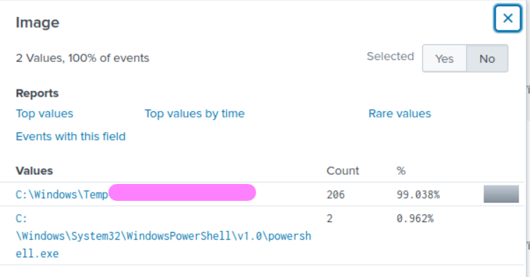
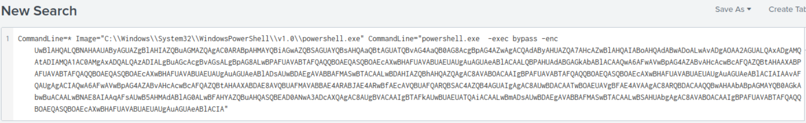
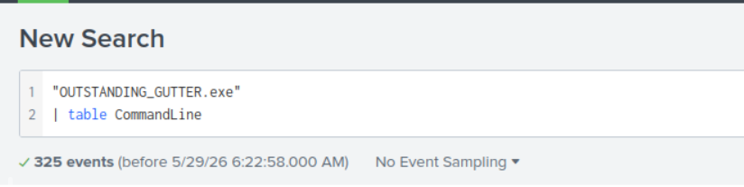

# PS Eclipse CTF

## Objective

Use Splunk to investigate suspicious events on the client’s device and determine the attack activity.

---

## Investigation Steps

### 1. Suspicious binary download

**Question:**
A suspicious binary was downloaded to the endpoint. What was the name of the binary?

I searched using the IP address and investigated the `Image` field in Splunk. From there, I identified the name of the downloaded executable.

---

### 2. Download source address

**Question:**
What is the address the binary was downloaded from? Add `http://` to your answer and defang the URL.

While reviewing the `Image` field, I noticed PowerShell activity. I filtered the logs based on PowerShell execution and found an encoded command.

I used CyberChef to decode the Base64 string and then defanged the URL.

---

### 3. Elevated privilege execution

**Question:**
What command was executed to configure the suspicious binary to run with elevated privileges?

The PowerShell command identified in the previous step contained the command used for elevated execution.

---

### 4. Suspicious command line activity

**Question:**
What command was executed to configure the suspicious binary to run with elevated privileges?

I searched using the suspicious executable name and sorted the results by the `CommandLine` field to identify the executed command.

---

### 5. Privilege level and execution command

**Question:**
What permissions will the suspicious binary run as? What was the command to run the binary with elevated privileges?
(Format: User + ; + CommandLine)

The answer was identified using both:

- the previously decoded Base64 PowerShell command
- the suspicious command-line activity found in Splunk

---

### 6. Remote connection activity

**Question:**
The suspicious binary connected to a remote server. What address did it connect to? Add `http://` to your answer and defang the URL.

I searched for the suspicious executable and sorted the results by `QueryName`. After identifying the remote domain, I defanged the URL using CyberChef.

---

### 7. PowerShell script download

**Question:**
A PowerShell script was downloaded to the same location as the suspicious binary. What was the name of the file?

The binary was downloaded into the Temp directory, so I filtered events related to that location and identified the PowerShell script stored there.

---

### 8. Actual malicious script name

**Question:**
The malicious script was flagged as malicious. What do you think was the actual name of the malicious script?

I checked the file hash using VirusTotal and identified the real malware name.

---

### 9. Ransom note IOC

**Question:**
A ransomware note was saved to disk, which can serve as an IOC. What is the full path where the ransom note was saved?

Knowing the real malware name from the previous step, I filtered events using wildcards (`*`) in the target filename field and identified the ransom note path.

---

### 10. Wallpaper modification

**Question:**
The script saved an image file to disk to replace the user's desktop wallpaper, which can also serve as an IOC. What is the full path of the image?

The image path was identified from the same events used in Question 9.

---

## Tools used

- Splunk
- CyberChef
- VirusTotal

---

## Key skills practiced

- Log analysis
- PowerShell investigation
- Base64 decoding
- IOC identification
- Threat hunting
- Splunk searching and filtering
- Malware investigation
