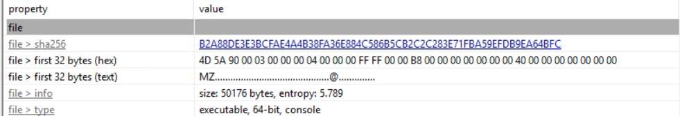
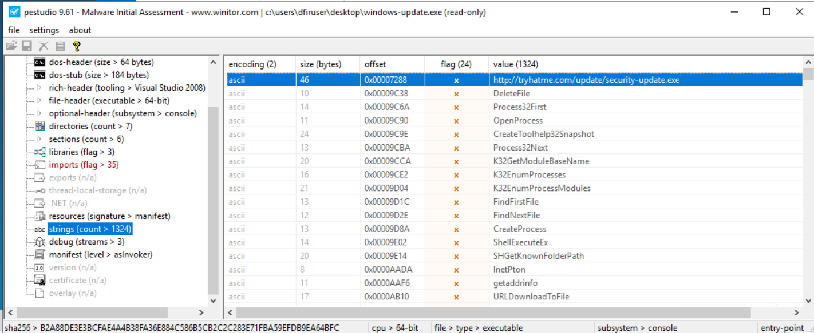
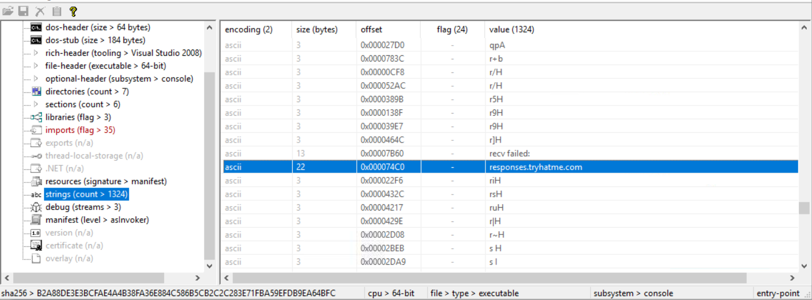
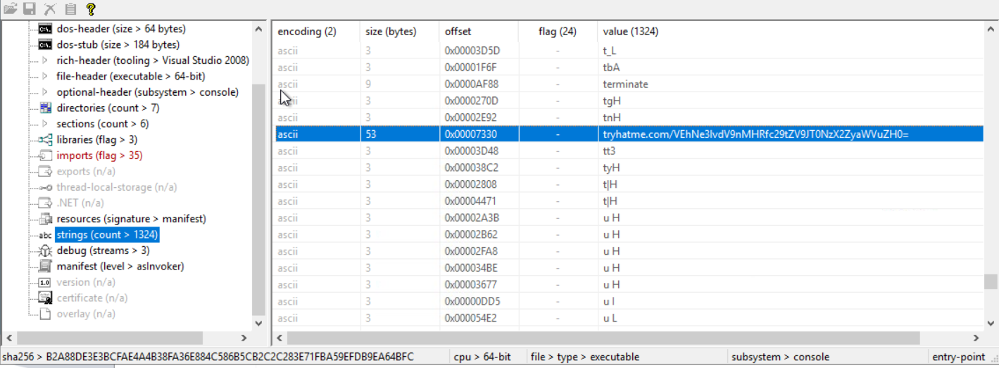
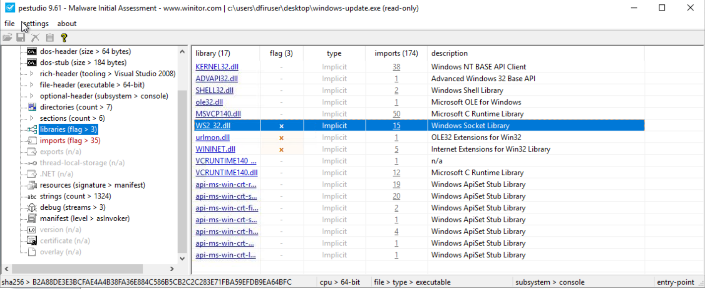
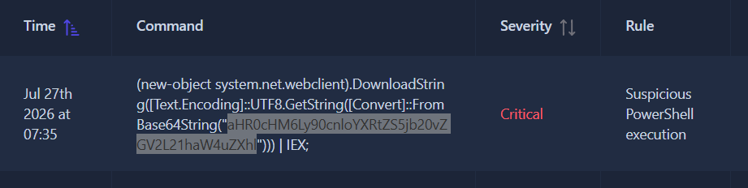
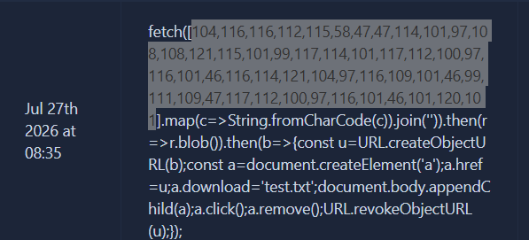

# Shadow Trace

## Objective

Analyze a suspicious executable, identify potential Indicators of Compromise (IOCs), and investigate the generated alerts to determine whether the observed behaviour is malicious.

---

# File Analysis

## Questions 1 & 2

I began by analyzing the suspicious executable using **PEStudio**.

From the **General** information section, I identified the architecture of the binary, which answered **Question 1**. In the same analysis, I obtained the file hash, which was required for **Question 2**.

---

## Question 3

To identify any embedded URLs, I navigated to the **Strings** section in PEStudio and sorted the entries using the **Flag** filter. This highlighted suspicious strings, allowing me to locate the URL.

---

## Question 4

While reviewing the strings, I continued scrolling until I located the suspicious domain referenced by the executable.

---

## Question 5

The identified string was encoded, so I copied it into **CyberChef** and decoded it to reveal the required value.

---

## Question 6

To determine which networking library the executable relied on, I examined the **Libraries** section in PEStudio. There I found the Windows Sockets library (`ws2_32.dll`), indicating that the executable contains networking functionality.

---

# Alert Analysis

## Questions 1–3

To investigate the generated alerts, I first decoded the suspicious URL using **CyberChef**. The decoded data revealed the requested information, including the filename associated with the alert.

The relevant details are shown below.

---

# Final Thoughts

This exercise demonstrated how static analysis can quickly uncover valuable indicators without executing a suspicious file. Using **PEStudio**, I was able to extract hashes, URLs, domains, imported libraries, and encoded strings that served as valuable IOCs. Correlating these findings with the generated alerts helped confirm the malicious behaviour and provided a clearer understanding of how the executable communicates and operates.
