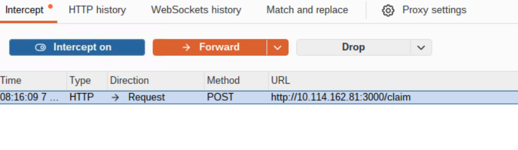
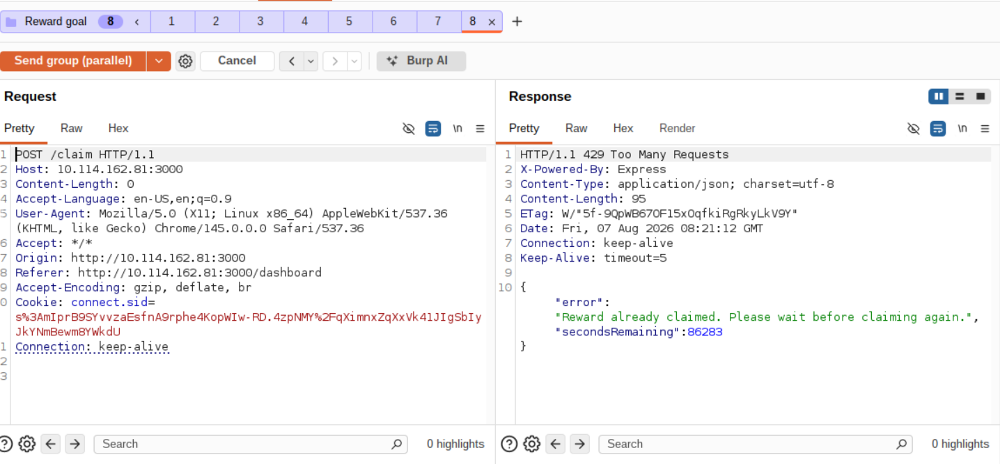
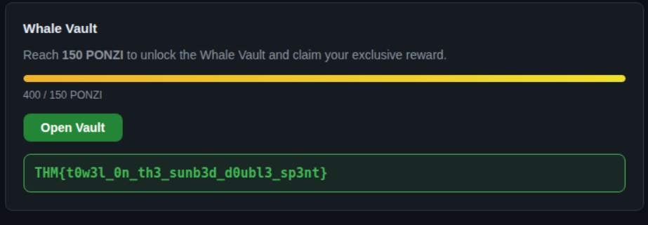

# Towel on the Sunbed

## Objective

This is the eighth challenge from [TryHackMe](https://tryhackme.com)'s **Hacker Holidays 2026**, focusing on **Web Exploitation**.

The objectives were to:

- Create a guest account and explore Ponzi's daily reward mechanism.
- Determine what prevents users from reaching **Whale Vault** status.
- Bypass the restriction and retrieve the flag from the vault.

## Investigation Steps

I began by visiting the provided website and creating a guest account. After logging in, I explored the application's functionality to understand how the daily reward system worked.

To inspect the requests sent by the application, I configured **Burp Suite** as my proxy. I then created another guest account, enabled **Intercept**, and clicked the **Claim Reward** button. Burp Suite captured the HTTP request responsible for claiming the daily reward.

Instead of forwarding the request to the server, I sent it to **Repeater** and dropped the intercepted request so it would not be processed. I then disabled interception to continue interacting with the application.

The vulnerability appeared to be related to a race condition, so I duplicated the reward request multiple times in **Repeater** and used Burp Suite's **Send group (parallel)** feature to send seven identical requests simultaneously.

This caused multiple reward claims to be processed at nearly the same time, allowing my account balance to increase beyond the intended daily limit.

After refreshing the website, I observed that my balance had increased enough to unlock **Whale Vault** status.

Finally, I selected the **Open Vault** option, which revealed the flag.

## Final Thoughts

This challenge demonstrated how race conditions can occur when applications fail to handle concurrent requests safely. Although the application was intended to allow only a single daily reward claim, multiple requests processed simultaneously bypassed this restriction.

The exercise highlighted the importance of implementing proper server-side synchronization, atomic transactions, and validation checks when handling actions that modify shared resources. Without these protections, attackers may exploit timing issues to gain unintended advantages or bypass application logic.
