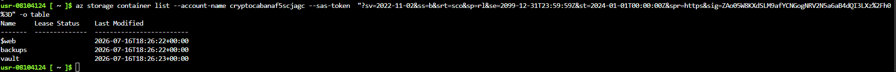
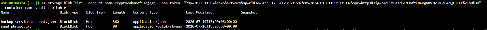
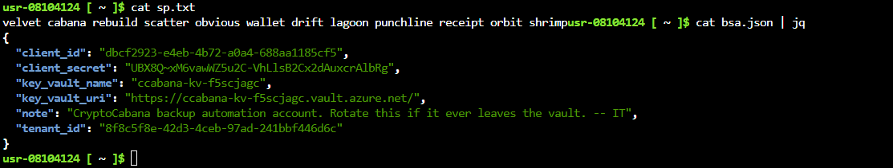
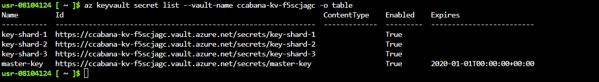
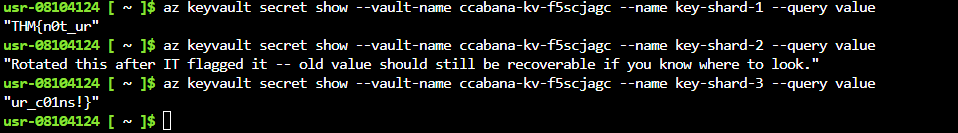
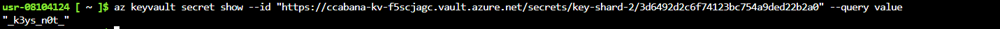

# CryptoCabana

## Objective

This is the ninth challenge from [TryHackMe](https://tryhackme.com)'s **Hacker Holidays 2026**, focusing on **Cloud Security**.

The objectives were to:

- Investigate what the kiosk provides automatically before any interaction.
- Follow the trust relationship to resources that are not directly exposed by the kiosk.
- Locate a second, more valuable set of credentials.
- Access the vault and recover the hidden flag.

## Investigation Steps

I began by visiting the provided website and inspecting its source code. I noticed that the application was using a JavaScript file, so I examined the script for any sensitive information.

While analyzing the JavaScript, I discovered a **hardcoded SAS token**. The token provided access to an Azure Storage container, and the permissions indicated by `sp=rl` allowed me to **read and list** the contents.

While enumerating the available storage resources, I discovered a container named **vault**. I inspected the container and found two files.

I downloaded both files and examined their contents.

The files contained credentials for a **service principal**. I used these credentials to authenticate and then investigated the associated **Azure Key Vault**.

The Key Vault contained four entries:

- Three key shards
- One master key

I was unable to read the value of the master key. However, the key shards contained parts of the flag. One of the key shards was rotated, so I initially recovered only **two out of the three parts** of the flag.

For `key-shard-2`, I investigated its previous versions. I listed the older versions of the secret and retrieved an older version using its version ID.

The previous version contained the missing part of the flag, allowing me to reconstruct the complete flag.

## Final Thoughts

This challenge demonstrated how a small cloud misconfiguration can lead to a chain of compromises across multiple Azure services.

The investigation started with a hardcoded SAS token in client-side JavaScript, which provided access to an Azure Storage container. From there, the exposed files revealed service principal credentials, which could then be used to access an Azure Key Vault.

The challenge also demonstrated the importance of **secret versioning**. Even when the current version of a secret is inaccessible or restricted, older versions may still contain sensitive information if they have not been properly secured or removed.

Overall, the challenge highlighted the importance of avoiding hardcoded credentials and tokens, applying the principle of least privilege, and properly securing cloud storage, service principals, and secrets.
