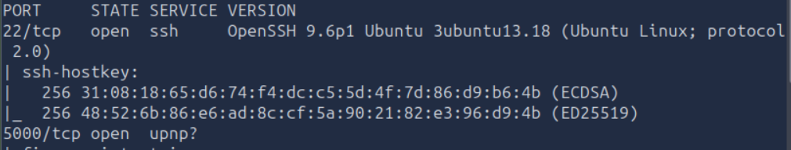
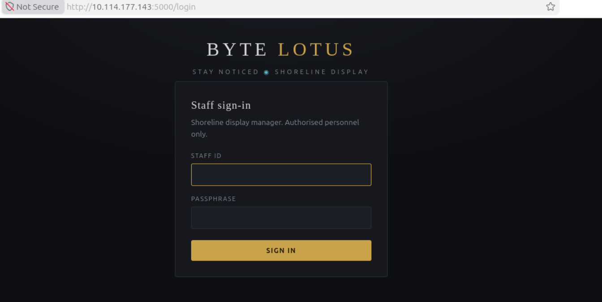
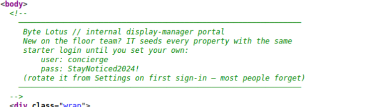
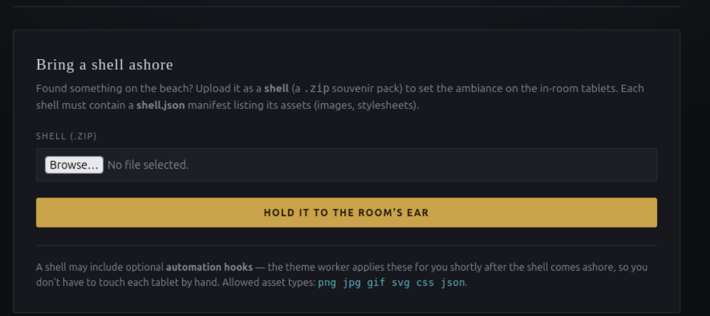
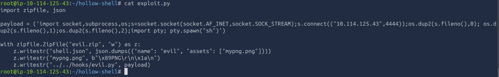
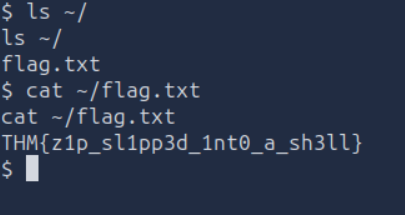

# The Hallow Shell

## Objective

This is the 10th challenge from [TryHackMe](https://tryhackme.com)'s **Hacker Holidays 2026**, focusing on **Web Security**.

The objective was to find the flag.

## Investigation Steps

I started with network discovery using Nmap.

```bash
nmap -sC -sV -oN scan.txt <IP_ADDRESS>
```

The scan revealed that the **SSH service** was open on port 22 and a **Gunicorn web server** was running on port 5000.



I went to the webpage hosted on port 5000, which presented a **staff sign-in page**. I tried a few generic credentials, but none of them were successful.



After inspecting the source code, I found a comment containing login credentials for the website.



I logged into the website using the discovered credentials. The new page contained a file upload functionality for `shell.json` or `.zip` files.



I created a PNG image using the PNG magic bytes:

```bash
printf '\x89PNG\r\n\x1a\n' > mypng.png
```

Next, I needed to create the shell.json file and upload it together with the PNG as a ZIP archive.

After some trial and error, I found that the following format worked:

```bash
echo '{ "name":"test","assets":["mypng.png"]}' > shell.json
```

Because Gunicorn is running the application with Python, I decided to use a Python script to establish a reverse shell. I created the script, started a Netcat listener on port 4444, and then uploaded the file through the application.



After the file was processed, I successfully received a connection from the target machine. I then explored the user's home directory and found the flag.



## Final Thoughts

This challenge demonstrated how an insecure file upload functionality can lead to remote code execution and ultimately provide access to the underlying system. It also highlighted the importance of properly validating uploaded files and ensuring that user-controlled files cannot be executed by the web application.
