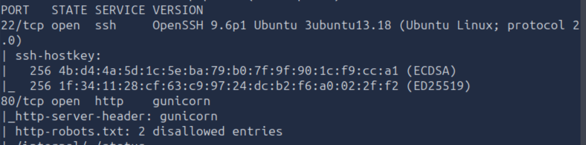
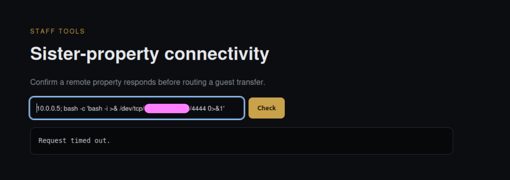
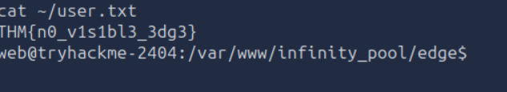

# Infinity Pool

## Objective

This is the 11th challenge from [TryHackMe](https://tryhackme.com)'s **Hacker Holidays 2026**, focusing on **Boot2Root**.

The objectives were to:

- Find the **user flag**.
- Escalate privileges and find the **root flag**.

## Investigation Steps

I started with network discovery using Nmap:

```bash
nmap -sC -sV -oN scan.txt <IP_ADDRESS>
```

I found two open ports: **SSH on port 22** and **HTTP on port 80**, with the HTTP service running a Gunicorn web application.



Nmap also identified a `robots.txt` file containing two disallowed entries: `/internal` and `/status`.

I navigated to `/status` and discovered a container where commands could be injected. My plan was to use this command injection to obtain a reverse shell.

I started a listener on my machine:



I successfully received a connection from the target and was able to access the container. After exploring the available files, I found the **user flag**.



## Final Thoughts

This part of the challenge demonstrated how seemingly harmless information in `robots.txt` can reveal hidden endpoints. The `/status` endpoint then exposed a command injection vulnerability that provided access to the container.

It was also interesting to see that prompt injection provided an alternative way to retrieve the user flag, demonstrating how multiple vulnerabilities can sometimes lead to the same result.
