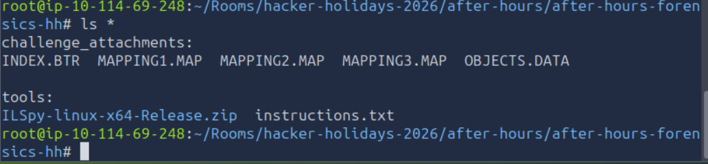
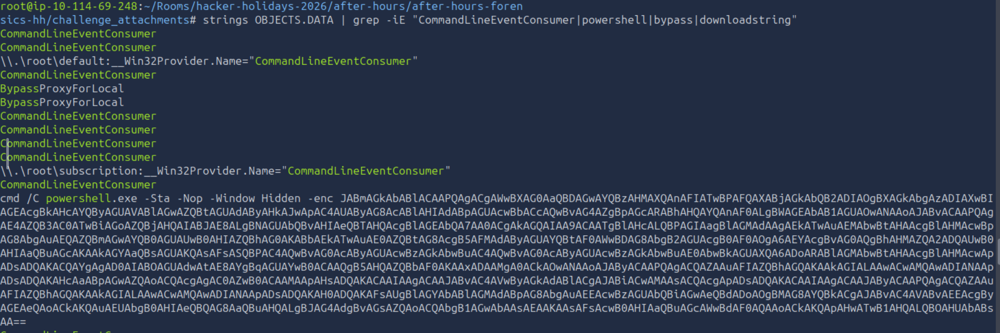
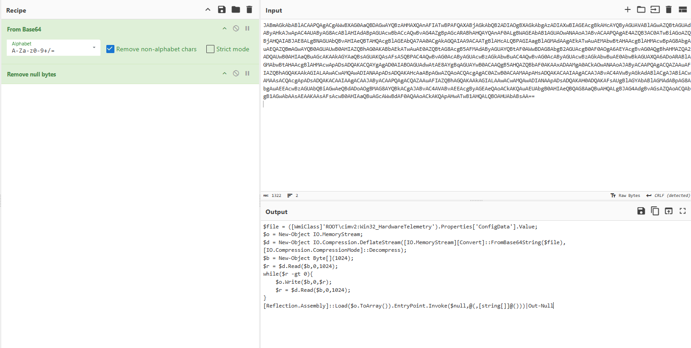
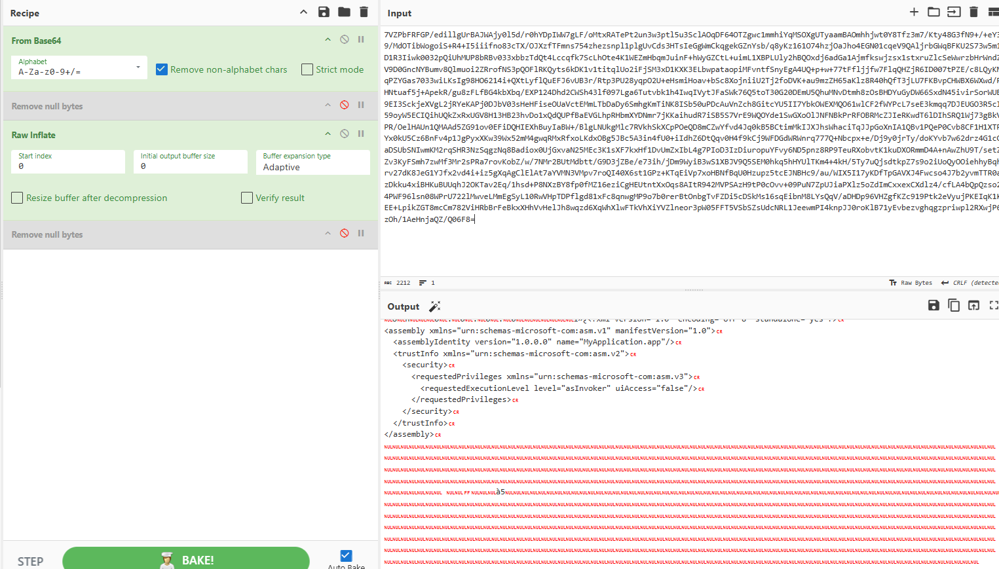
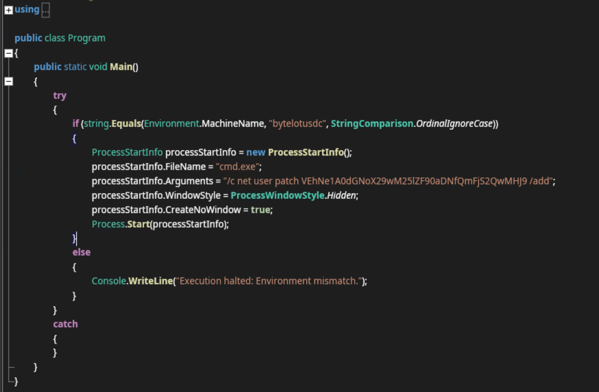
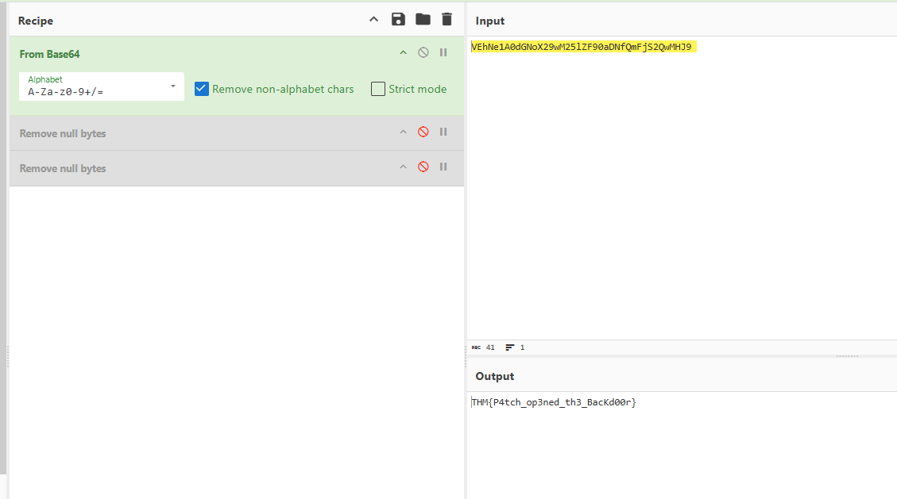

# After Hours

## Objective

This is the 12th challenge from [TryHackMe](https://tryhackme.com)'s **Hacker Holidays 2026**, focusing on **Forensics**.

The objectives were to:

- Parse the provided system artifacts for hidden custom configuration data.
- Locate the malicious class and extract its embedded payload.
- Decode the payload and recover the flag.

## Investigation Steps

I began by downloading and extracting the provided task files.

The extracted files were Windows WMI Repository files. **WMI (Windows Management Instrumentation)** is a Windows subsystem that allows Windows and applications to query and manage information about the system.

In this case, `OBJECTS.DATA` was particularly interesting because the WMI repository stores persistent WMI information there.

### 1. Analyzing `OBJECTS.DATA`

I started by using the `strings` command on `OBJECTS.DATA` to search for readable strings and potentially encoded data.

I found an encoded PowerShell command.

The command was Base64-encoded, so I copied the encoded string into **CyberChef** and decoded it.

The decoded command revealed a **fileless/in-memory execution technique**, where PowerShell was used to execute code without first writing a traditional executable to disk.

### 2. Finding the ConfigData

I continued searching through `OBJECTS.DATA` using the `strings` command to locate the `ConfigData` referenced by the PowerShell command.

I found another encoded string, which I decoded using **CyberChef**.

After decoding it, I saved the resulting file to my virtual machine for further analysis.

### 3. Analyzing the Extracted Binary

I opened the extracted file using **ILSpy** to inspect the .NET code.

I focused on the `Main` function to understand what the program was doing.

The program checked whether the computer's hostname was `bytelotusdc`. If the hostname matched, the program created a new user named `patch` with the following password:

`VEhNe1A0dGNoX29wM25lZF90aDNfQmFjS2QwMHJ9`

The password itself was Base64-encoded. I decoded it using **CyberChef**, which revealed the flag.

## Final Thoughts

This challenge demonstrated how attackers can use **WMI persistence** and **fileless PowerShell execution** to hide malicious activity within a Windows system.

The investigation required correlating several artifacts rather than relying on a single piece of evidence. By examining `OBJECTS.DATA`, identifying the encoded PowerShell command, recovering the `ConfigData`, and finally analyzing the extracted .NET binary with ILSpy, I was able to trace the execution chain and recover the flag.

The challenge also highlighted why forensic analysis of Windows WMI repositories is important when investigating suspicious persistence mechanisms. Malicious activity may not always be visible through traditional files on disk, making system artifacts such as the WMI repository valuable sources of evidence.
