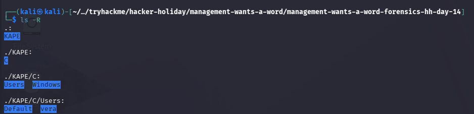
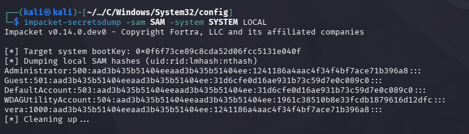
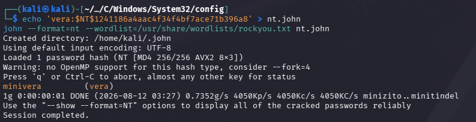

# Management Wants a Word

## Objective

This is the last challenge from [TryHackMe](https://tryhackme.com)'s **Hacker Holidays 2026**, focusing on **Forensics**.

The objective are to  
Take a closer look at what she left behind

Some things aren't as locked away as she thought

Find out what she was hiding, and claim the flag

## Investigation Steps

I first downloaded the task files and unzipped them on my vm.

This seems to be a full Windows triage image extracted with KAPE. Becasuse there are WINDOWS, SAMN , SYSTEM and Vera's profile, the next step is to do offline credential recovery.

I cracked this using john and got vera's password

## Final Thoughts

This challenge demonstrated how carefully crafted instructions can influence the behaviour of an AI assistant and potentially cause it to reveal information that it was intended to keep protected.

It highlighted an important security concern when developing AI-powered applications. AI assistants should not blindly follow user-provided instructions, especially when those instructions could conflict with their intended rules or cause sensitive information to be disclosed.
